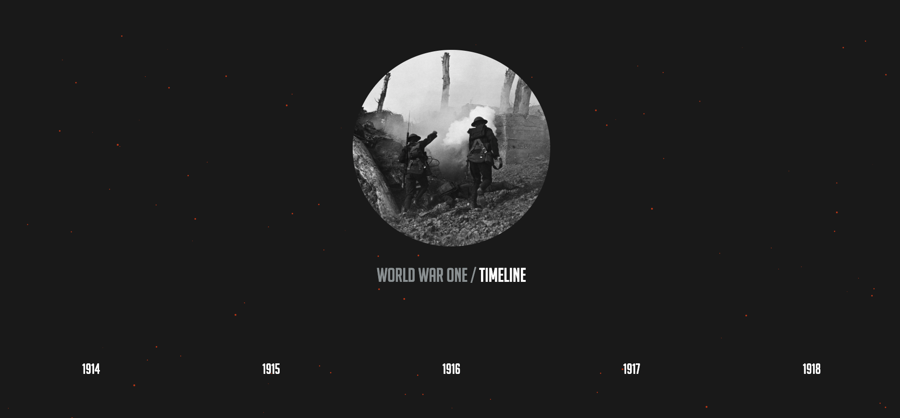
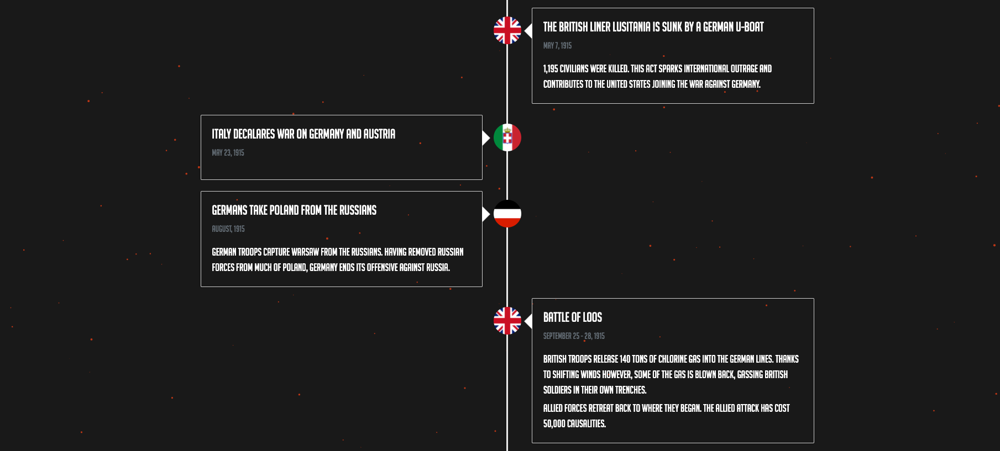

# World War 1 Timeline
This timeline is a webapp built with HTML, CSS, and Node.js 

I started working on this app while reading A World Undone by G.J. Meyer, and my goal with this app was to keep track of major events while improving my ability to create scalable web applications 

The animated ashes in the background were developed using particles.js, which can be found [here](https://vincentgarreau.com/particles.js/)
